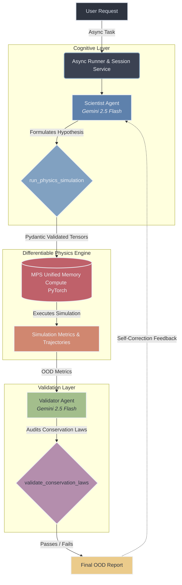

# 🪐 Project Noether

> **An Agentic Scientific Simulation System for Theoretical Physics & Advanced MLOps**

[](https://www.python.org/downloads/)
[](https://pytorch.org/)
[](https://google.github.io/agent-development-kit/)
[](https://fastapi.tiangolo.com/)
[](https://github.com/astral-sh/uv)

---

## 🎯 The End Goal

**Project Noether** bridges generative deep learning (Diffusion models / Normalizing Flows) with deterministic theoretical physics simulations via Google's Agent Development Kit (ADK).

Neural networks inherently "hallucinate" physically impossible states—such as energy spontaneously springing into existence or momentum diverging asynchronously—when pushed to chaotic out-of-distribution (OOD) edge cases.

Our fundamental objective is to test the **OOD robustness of generative physics models**. By utilizing a sophisticated adversarial multi-agent orchestration layer, the system autonomously designs mathematically constrained edge-case simulations. Uncompromising agents then audit the neural network's outputs against bedrock conservation laws (e.g., Hamiltonian energy and total momentum vector conservation) to detect, isolate, and quantify non-physical AI hallucinations.

---

## 🧠 Why Project Noether? (Advanced MLOps)

This repository serves as a masterclass in production-grade MLOps for complex, multi-modal systems. Moving decisively beyond standard chat interfaces, it pioneers autonomous scientific discovery pipelines by mapping stochastic LLM reasoning to rigorous, deterministic physical constraints.

1. **Agentic vs. LLM Paradigms:**
   We enforce strict lifecycle state management using ADK's `Runner` and `InMemorySessionService`. This intentionally shifts away from stateless, single-turn API calls to asynchronous event loops maintaining deep, multi-turn ReAct reasoning traces.

2. **Pydantic Guardrails:**
   Bridging stochastic cognitive outputs with the uncompromising numerical demands of PyTorch operations. Advanced Pydantic schema validation ensures the LLM's reasoning is strictly structured—preventing hallucinations from injecting non-physical parameters (e.g., negative mass, infinite velocities) that induce exploding gradients and NaNs in the tensor graph.

3. **Hardware Optimization:**
   Architected natively to exploit Apple Silicon (M4/MPS) optimization. We leverage Unified Memory architecture to circumvent traditional PCIe latency bottlenecks. High-dimensional tensors are seamlessly constructed by the cognitive layer (CPU) and instantaneously simulated by the differentiable physics engine (GPU).

4. **Adversarial Orchestration:**
   The framework deploys a dual-agent paradigm. A **"Scientist Agent"** dynamically probes complex topological boundaries (e.g., extreme mass ratios and high-velocity collisions), while a **"Validator Agent"** enforces an uncompromising mathematical guardrail, guaranteeing the generative model abides strictly by Noether’s Theorem.

---

## 🏛️ System Architecture

Our adversarial feedback loop models continuous scientific hypothesis generation, physics computation, and unyielding validation.



---

## 🗂️ Fractal Project Structure

```text
ProjectNoether/
├── src/
│   ├── agents/            # Cognitive orchestrators (Scientist, Validator)
│   ├── backend/           # FastAPI service boundaries (API routing & state)
│   ├── core/              # Foundational cognitive architecture (Memory, Tools, Pydantic guardrails)
│   ├── environment/       # Differentiable physics engines (MPS-accelerated)
│   └── utils/             # Telemetry, logging, and metrics
├── config/                # YAML configurations for models and orchestrators
├── data/                  # Local vector stores, session memory, and .pt tensor trajectories
├── notebooks/             # Exploratory data analysis and hypothesis testing
├── tests/                 # Pytest suite for deterministic execution
└── test_scientist.py      # The autonomous multi-agent execution loop
```

---

## 🚀 Quick Start

Ensure you have [uv](https://github.com/astral-sh/uv) installed—a modern, extremely fast Python package and project manager.

### 1. Environment Setup

Clone the repository and initialize your environment settings:

```bash
# Clone the repository
git clone https://github.com/Arif-Badhon/MLOps_System_Vibe.git project-noether
cd project-noether

# Provision environment variables (copy the default template if available)
cp .env.example .env
```

Ensure your `.env` contains the required Google API Key to authorize the ADK conversational loop:

```env
# .env
GOOGLE_API_KEY="your_gemini_api_key_here"
```

### 2. Run the Multi-Agent Experimental Loop

Initialize the asynchronous multi-agent orchestrator utilizing local Unified Memory compute:

```bash
# Boot the experimental test loop natively using uv
uv run python test_scientist.py
```

The terminal will stream the `Scientist Agent` formulating an extreme edge-case hypothesis (e.g., a chaotic, high-velocity 3-body collision), mathematically configuring the initial state, validating through Pydantic guardrails, and instantaneously resolving the dynamic layout on your hardware’s GPU via PyTorch MPS.

---
*Architected for the vanguard intersection of foundational learning models and rigorous theoretical physics.*
